# Team: Duke Nguyen, Hugh Greethead, Harry Buisman

# An Integrated Virtual Health Consultation Dashboard

## Purpose

CloudClinic is a holistic healthcare consultation web service that seeks to integrate common medical practice tasks and processes into a unified system. The application primarily aims to merge the scheduling of appointments, telehealth video conferencing, patient summaries, past visit details, medication protocols, and analysis of lab results into a single piece of software. At its core, CloudClinic will serve as a management and interaction portal between doctors and patients where healthcare information can be shared and stored privately.

One of the primary aims of the project is to build a holistic healthcare solution that can be adopted by multiple medical practices and their patients. In doing so, common tasks such as providing specialist referrals, checkup scheduling, documentation of patient health, and client billing can be integrated into a monolithic application. The advantage of synthesising recurrent tasks into a piece of software becomes evident through the time saved on processing medical administration. Furthermore, patient data can be accessed in a single location, which can help streamline the way in which records are managed between primary, secondary, and tertiary medical organisations.

## Functionality and features

### MVP Functionality

#### User authentication/login system

The architecture and implementation of the authentication system used in CloudClinic is the most important part of the functionality that the application will have. The two user groups of the application are split into two clearly defined roles, doctors and clients.

Authentication is needed for clients to use the application, as a user and profile are needed to make bookings with doctors - the primary purpose of the application. Similarly Doctors need to be authenticated users to manage bookings as well as protect who has access to the sensitive client data - i.e. biological/health details of the client.

- Role-based authentication (A two tiered login/authentication system)
- Users of the website can either only be a Doctor OR a Client
- Users only have permissions to use their dedicated parts of the website depending on their category
- The roles are presented at login screen - the user must understand if they have been registered as a Doctor or Client and pick the appropriate role

#### Appointment booking/calendar system

The purpose of this feature is to create a system where each Doctor can set their availability for appointments and let the booking system handle clients making appointments for their desired timeslots.

- Calendar - a graphical display of a doctors availability for appointments over a one week time span
- Manage appointments - Ability to set and edit calendar availability for new appointments and cancel upcoming booked appointments
- Doctors with CRUD control, clients can only update and delete (book and cancel)

#### Dashboards

The dashboards serve the purpose of collecting all of the relevant information that both the Doctor and Client users will need in a convenient and manageable location.

#### Dashboard - Doctor

- Overview list/display of all current and past patients
- Each patient has profile details which displays all relevant basic user information
  - Name, Age, Sex, Marital Status, Height, Weight, Children, Phone number
- Ability to add notes about the patient
  - Symptoms and general comments
- Calendar/list of scheduled appointments
  - Ability to access and manage all elements of the calendar/booking system

#### Dashboard - Patient

- Can see list of all doctors that work on the CloudClinic service
- Ability to select a Doctor and view their availability for appointments
- View list of upcoming appointments (Doctor + time/date), with ability to reschedule or cancel
- View list of past appointments

#### Search Functionality

As the user base of CloudClinic grows and therefore both the number of clients and doctors in the application increases, there is a greater need for search/filtering capability. Clients need to be able to search for specific Doctors that they would like to book appointments with while Doctors need to be able search through their client list, as well as be able to search the Doctors list if they require further information - e.g. when making a referral. Additional filter parameters such as age, sex, qualifications etc could also be added.

- Clients
  - Ability to search for Doctors via name
- Doctors
  - Ability to search through their list of clients via name
  - Ability to search for other Doctors via name
- Other filtering parameters to be decided, but like to be based on the key profile attributes for each of Doctors and Clients such as age, sex and specialisations for Doctors

### Extended Functionality

Ideally the intention of CloudClinic is to be able to provide an all-inclusive solution for managing and conducting medical/doctor appointments entirely online through the application. To be able to provide this service, the booking/appointment functionality must be extended to enable real-time communication.

Due to time restraints, these features will only be implemented into CloudClinic once the core features of authentication, dashboards and booking system have been completed and tested in its entirety.

#### Live text chat/messaging between doctor and patient

From either the patient or the doctor dashboard, there will be the ability to initiate a live text chat, that is confidential between the patient and client.

#### Live video conferencing sessions between doctor and patient

Doctors will be able to initiate a live web conferencing session with their clients, allowing them to interact and observe the patient directly from within the application.

#### Encrypted Data Storage of medical information/records/patient data

In order to handle and store sensitive medical/health data in an application, strict privacy and security standards must be met. [ISO27018](https://www.iso.org/standard/76559.html) is one of the leading international standards for how medical data should be handled, requiring strict processes for encryption and management of data. For our project to be commercially feasible, it is likely that we will need to rework the implementation of our database to be encrypted as well as potentially removing certain data fields from the functionality of the application.

This could prove to be a time consuming process that will require further research and understanding of global standards, therefore this functionality is deprioritised until a successful prototype/proof of concept has been successfully implemented and tested.

## Target Audience

CloudClinic is primarily targeted towards medical professionals, including general practitioners, physicians and their patients. The application consists of two separate login portals for each type of user, and contains software features that are exclusive to medical professionals and patients respectively. For example, a medical clinic can register their practice and gain access to features such as patient scheduling, reports, room view, telehealth, and invoicing. On the other hand, non-medical individuals who sign up on CloudClinic will have access to a tailored subset of features, such as telehealth, the ability to book an appointment, and access to their past clinic visits. In light of recent global events with the spread of COVID-19, CloudClinic aims to facilitate consultations in a socially distant manner to minimise the risk of transmission between doctors and patients alike.

## Tech Stack

- MongoDB
- Express.js
- React
- Node.js
- React Context API
- Mongoose
- Passport.js
- JEST
- Cypress
- Sass
- Socket
- Peer.js

CloudClinic is a full stack application built on the MERN stack (MongoDB, Express, React and Node) and utilises a range of open source libraries to assist with accelerating development time and improving authentication security. MongoDB was chosen as the Database Management System (DBMS) for several reasons, including that it affords dynamic and flexible document schemas that can contain a wide range of data attached to both patients and doctors respectively. Furthermore, MongoDB stores document data in Binary JSON (BSON), which integrates seamlessly with the core JavaScript-driven technologies of CloudClinic’s tech stack.

React is utilised on the front-end of CloudClinic, and is primarily responsible for handling the view layer of the application, including the user interface (UI), text, images, and making networking requests to API endpoints. The framework supports building reusable components that dramatically improve code quality, efficiency, and the scalability of the codebase. Express and Node are the server-side technologies that handle the backend business logic of CloudClinic, including routing, middleware integration, and network requests to RESTful API endpoints. React’s Context API is used for global state control and management of themes across the entire application.

A JSON Web Token strategy for authentication of users will be employed. It allows RESTful endpoints to be authenticated without needing sessions. A local username and password authentication strategy is also being considered, to allow users to authenticate using a username and password stored in the Node.js application, to provide a familiar login flow for users of the application. If multiple authentication strategies are used, the authentication library [Passport.js](http://www.passportjs.org/) will be utilised, Passport is Express.js compatible authentication middleware for Node.js. Passport is an unobtrusive framework that makes authentication simple, able to perform regardless of database schema.

Mongoose will be used with our MongoDB implementation, it is an Object Data Modelling (ODM) library for use with MongoDB and Node.js. It assists in managing the relationships between data, provides schema validation and is used to translate between objects in Node.js code and the representation of those objects in MongoDB.

Testing frameworks will be used to validate the functionality and correctness of the code to match the specification. JEST will be used as it has easy compatibility with React and Node, making it simple to create unit tests. Cypress is a library for automated end-to-end tests. Cypress can perform any action that can be performed in the browser, such as clicking, which makes it a useful tool for simulating end user actions.

Custom Sass will be used to style the application. Sass facilitates cleaner and more compact CSS that will aid in keeping the application codebase more maintainable.

For the extended requirements of integrating live text chat and video conferencing, existing JS frameworks will be utilised for their ease of use and integration. For live chat, [Socket.io](https://socket.io/) and for video conferencing, [PeerJS](https://peerjs.com/) based on the WebRTC framework will be used.

## Dataflow Diagram

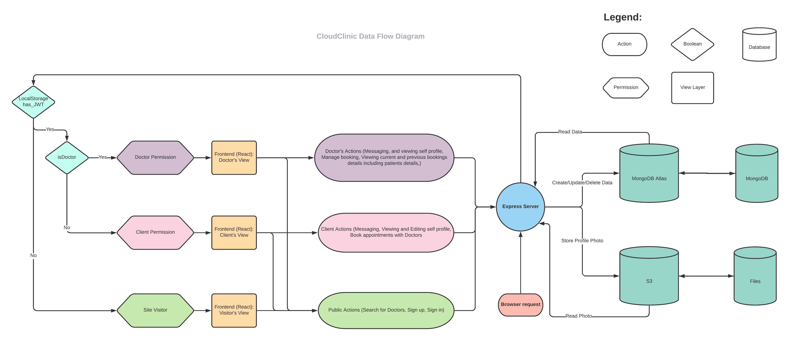

## Application Architecture Diagram

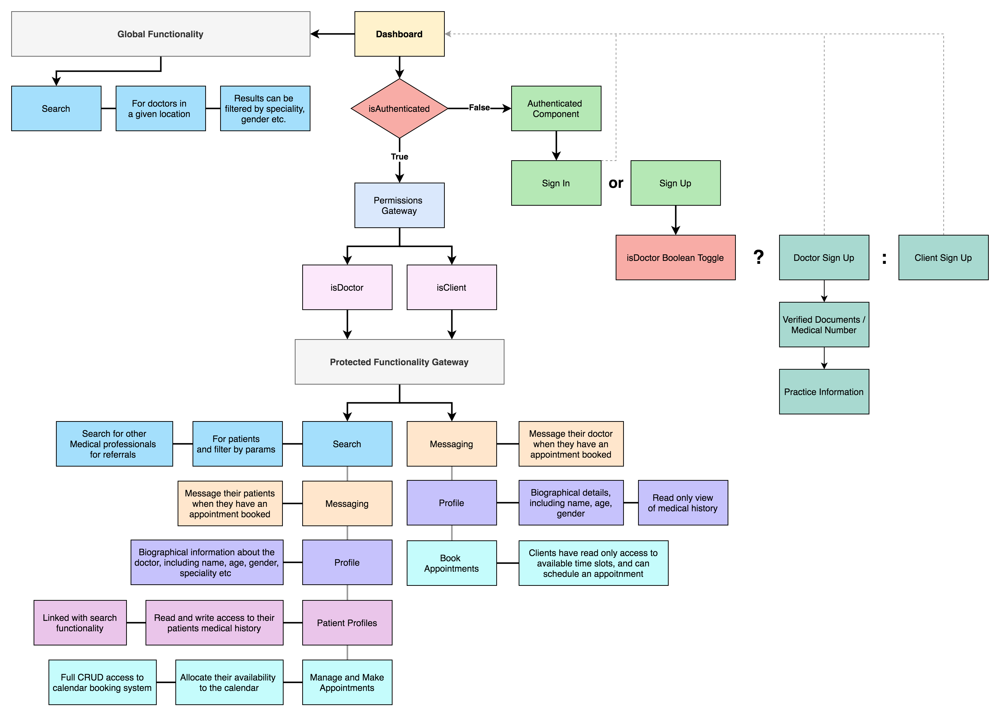

CloudClinic is a single page application (SPA) that utilises the dashboard component as the main wrapper element for rendering various view layers.

Unauthenticated users can ONLY use the dashboard to search for other doctors. All other application features sit behind protected routes, and attempting to access them will push the browser navigation to the authentication component view.

## User Stories

There are two key user groups of the CloudClinic application, Doctors and Clients. The motivations and intentions for using the CloudClinic application are very different for both the Doctor and Client, so the application has been designed with this in mind.

Doctors using CloudClinic have needs specific to managing all of their client-patients basic information and medical history in a succinct and organised manner, and facilitating the completion of virtual/tele-health appointments.

Clients, that is, regular non-doctor users of CloudClinic have needs that are primarily specific to making appointments with a Doctor on the application. Clients need to be able to inform themselves of who the Doctors on the service are, what their credentials are and their availability in order to make the decision on who and when to book.

Both clients and doctors have similar needs in viewing and managing their appointments.

### Doctor

#### MVP Requirements

- As a Doctor, I want to be able manage of all my client appointments in the one place, so I can minimise time spent on administrative tasks and focus more on my medical work/duties.
- As a Doctor, I want to be able to have a place where I can conveniently access and manage all the important medical information and other information/notes on my clients, so I can more effectively track symptoms, conditions and medications to help give more effective treatments to my clients.
- As a Doctor, I want to be able to specify my availability for appointments, so clients who wish to make an appointment with me can see when I am available and book an appropriate time.
- As a Doctor, unexpected things can happen that require my attention and time, so sometimes I need to reschedule/cancel appointments and/or change my availability for appointments

#### Extension Requirements

- As a Doctor, I would like to be notified when an appointment is made with me, so I can plan accordingly to best meet the client's needs.
- As a Doctor, I would like to be able to communicate remotely with a client, ideally in real time, so I can provide my services to a client at a safe distance and effectively communicate in order to be able to give the correct treatment and care.
- As a Doctor, if I am communicating live and remotely with a client, I would ideally like to be able to see them, so I can more accurately observe their behaviour and possible symptoms/conditions.
- As a Doctor, I may prefer to work as part of my own clinic or medical centre with my colleagues who I closely associate with in my network, I would like to be able to maintain a working relationship with other doctors even if I am working remotely.

### Client

#### MVP Requirements

- As a Client, I want to be able to view all of the doctors on the platform and what their availability is, so I can decide as to when I can make an appointment to see a doctor.
- As a Client, I want to know detailed information about a Doctor and their qualifications, so it can help me decide if I'd like to choose them to have an appointment with.
- As a Client, I want an easy way to make a booking for an appointment with a doctor, so I can minimise the amount of time and effort needed to be spent organising an appointment.
- As a Client, I want to be able to manage my bookings, such as cancelling it or rescheduling my appointment time, as unexpected things happen that require a change in plans.

#### Extension Requirements

- As a Client, I would like some way for it to be notified/confirmed that my booking was successful, so I can be assured that time has been allocated for me and my needs.
- As a Client, I want to be able to talk to my doctor directly, so I can discuss my symptoms/conditions and get the appropriate treatment and care that I need.
- As a Client, it would be ideal for me if the booking I make is automatically added to my schedule, so I do not forget my appointment time.
- As a Client, I would like to be able to view and leave feedback for the doctors, so I can help inform my decision about the quality of treatment I will get when deciding on which doctor to make an appointment with.
- As a Client, I want an easy way to search through all of the different doctors on the service and be able to filter according to different criteria/specialties so I can find a doctor that best suits my needs.

## Wireframes

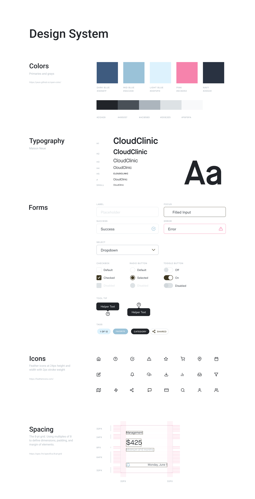
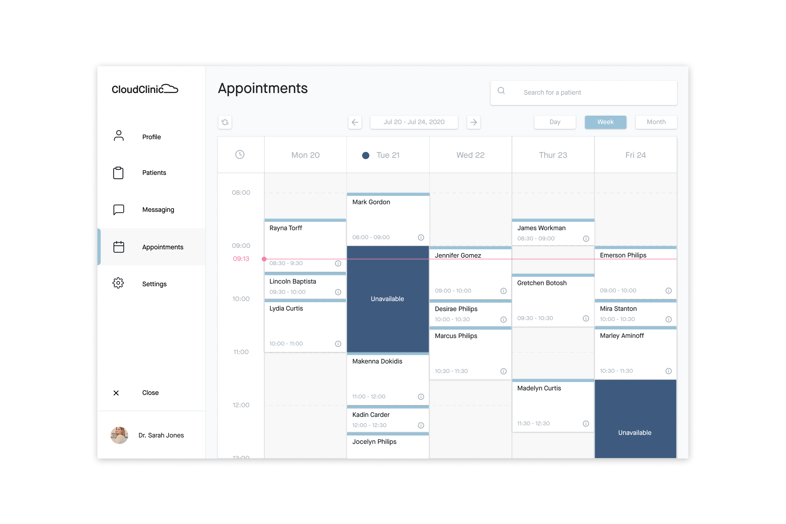
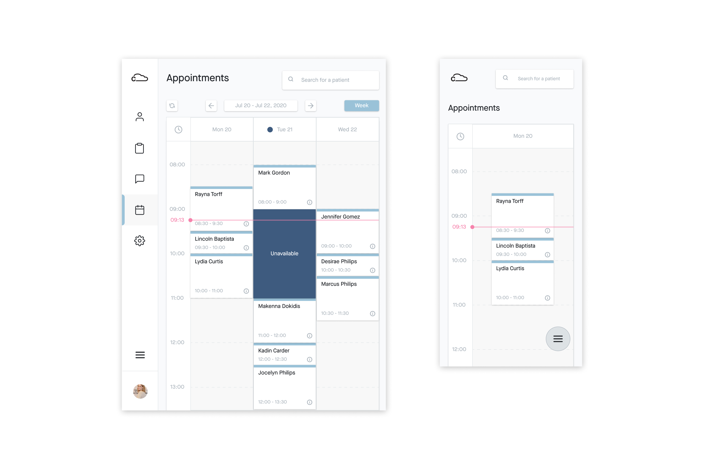
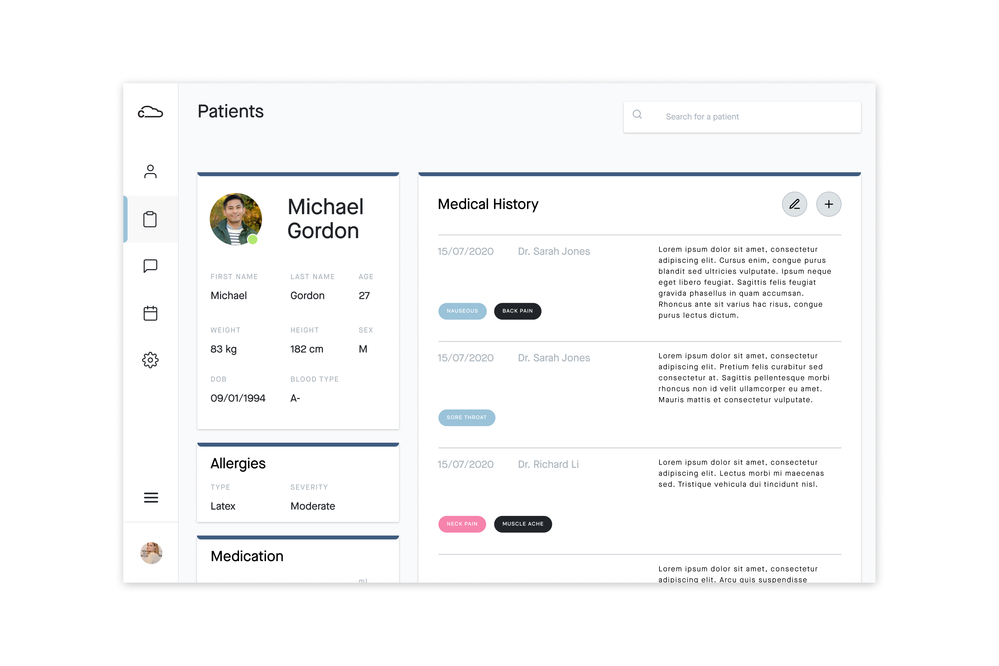
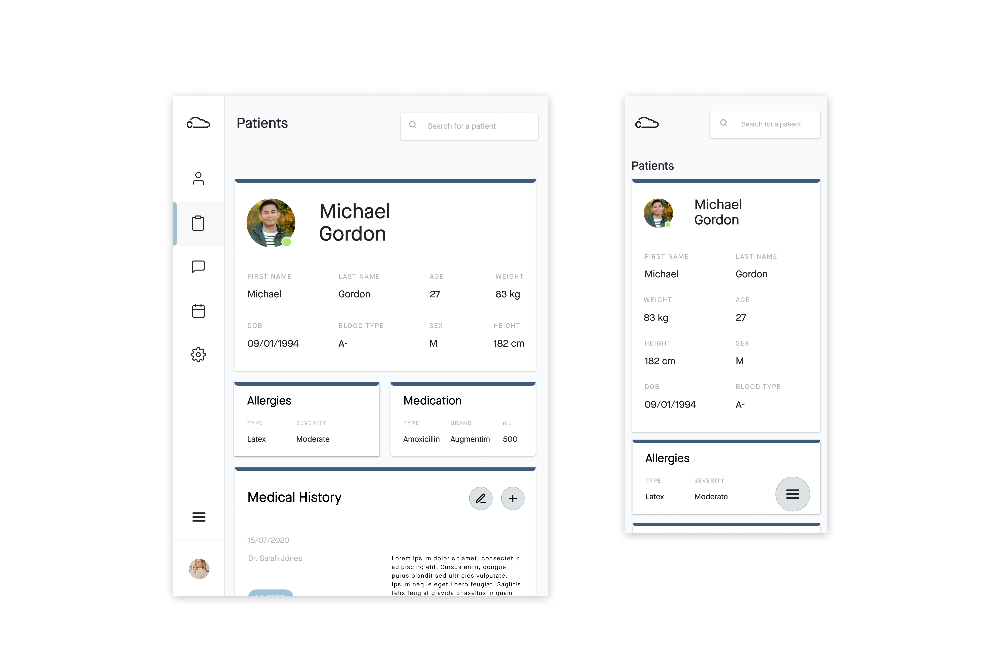
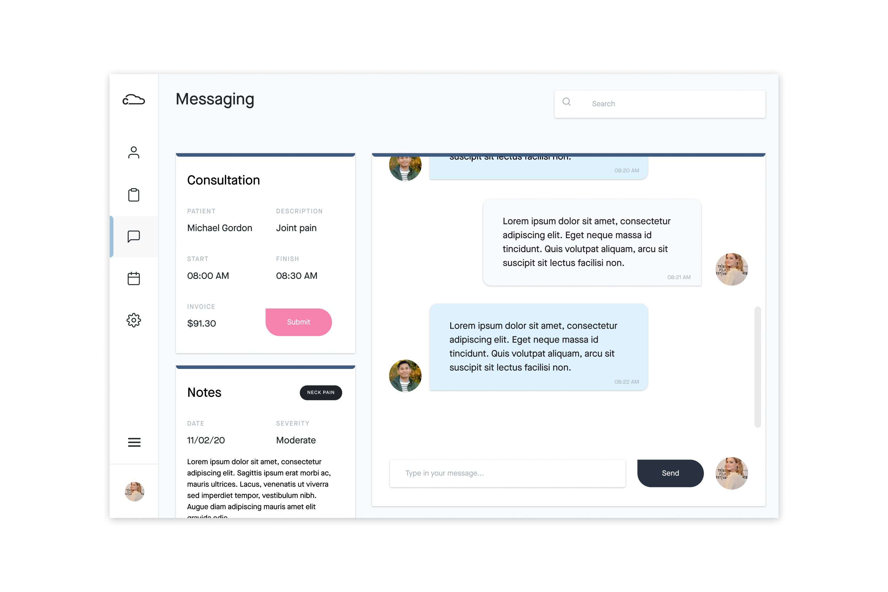
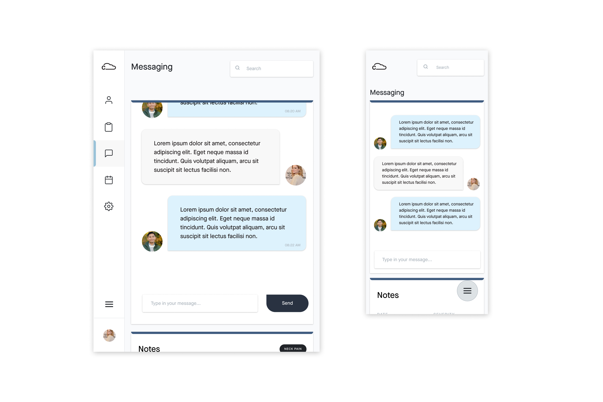

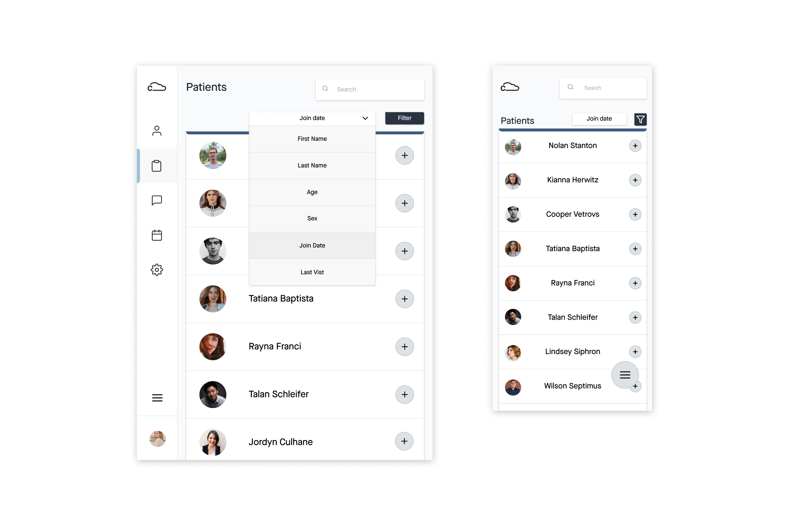
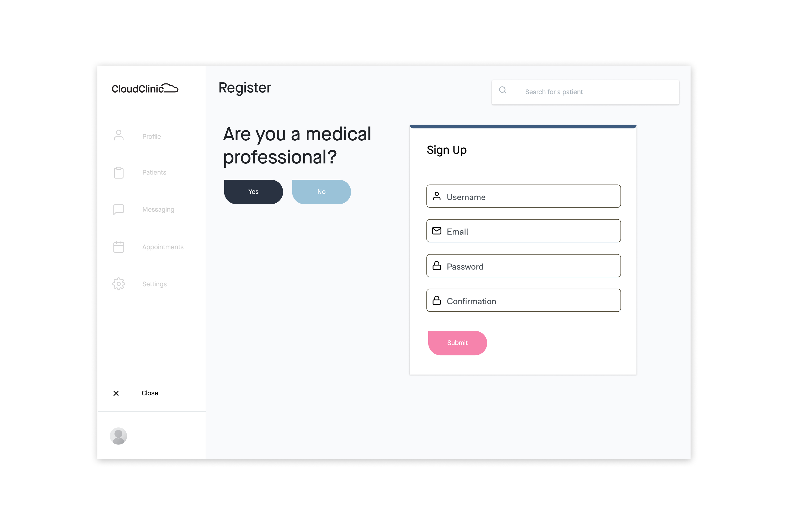
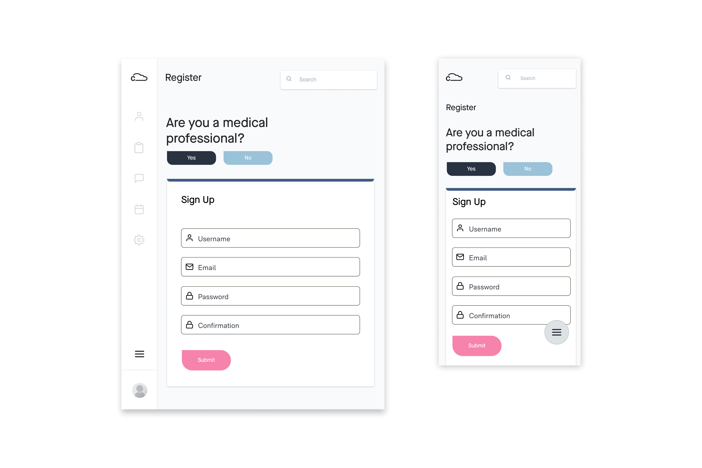

## Project Management

